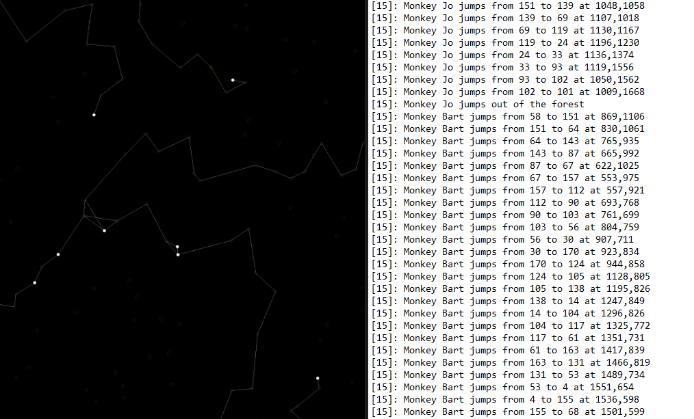

# Escape The Woods

> This is a small school assignment I personally liked to do. It was our first initiation with Entity Framework as well as some logging. I'd like to think this project resulted in a nice solution with readable clean code.
>  
>
> *In hindsight you always notice what could have been done better, but I'm going to leave it as a staple of my improvement.*

## Assignment outline

Create a virtual forest in which there will be multiple monkeys that will escape the forest in the "shortest" route possible. The monkeys will travel from tree to tree, always choose the closest tree and never visit the any of the previously visited trees.
Once the monkey is the closest to the edge of the forest, they are finished.

There are a few more specifics on how the exercise was limited, but lets get to the important bits:

- Must use Entity Framework Core
- Must use separated layers
- Must log specific info to both the database, as a text log
- Must create a small graphic for each forest in which the monkeys, trees and travelled path is visible
- Must use asynchronous programming so that the UI and other processes are not wasted waiting

## Example output

